# Report 

## Introduction 
This folder contains the application code and files for the **Paper Company Multi-Agent System Project**

## Contents

This folder has the following file contents: 
- `project_starter.py` - Full application code
- `.env` - File containing OpenAI API key 
- `workflow.png` - Mermaid diagram of the workflow of the multi-agent system 
- `final_report.json` - Output artifact representing the final financial report of the test run 
- `munder_difflin.db` - Database generated during the test run 
- `output_logs.txt` - Subset of print statements during the test run 
- `results.json` - Contains all the customer responses and financial information during the test run 
- `test_results.csv` - Contains all the customer responses and financial information during the test run 
- `report.MD` - This file 

## Running the code 
Run with `python project_starter.py`. Requires Python 3.11 and above, as well as the following libraries: 
- pandas 
- numpy 
- sqlalchemy
- smolagents
- openai 
- scikit-learn 
- pydantic 

## Explanation 
In this system, we have 4 Agents: Orchestrator, Inventory Agent, Quote Agent, Sales Agent 

In addition to these, I have also added new functions: 
- `get_stock_level_multiple_items` - Expands upon `get_stock_level` to retrieve the stock level of multiple inventory items as of a specified date.
- `search_quote_history_tfidf` - Expands upon `search_quote_history` to use a TF IDF vector search. 

### 1. Orchestrator

Core Responsibilities: 
- Parse the customer's natural-language request into structured data
- Coordinate the Inventory, Quote and Sales agents. 
- Return final customer-facing response. 

Primary entry tool: `handle_customer_request(...)`

Other functions: 
- `extract_items_from_request` - Used to parse customer request and return a Pydantic object, enforcing output validation. 
- `get_unit_price` - Used to obtain unit prices from DB as this is static data. 

### 2. Inventory Agent 

Core Responsibilities: 
- Does not mutate DB. 
- Check current stock levels
- Compare stock vs customer needs and minimum stock
- Determine if reordering is required
- Estimate supplier delivery dates
- Decide whether customer deadlines can be met

Tools used: 
- `tool_inventory_get_stock_single_item` - Gets stock of a single item 
- `tool_inventory_get_stock_multiple_items` - Gets stock of multiple items
- `tool_inventory_get_all_inventory` - Gets stock of all items
- `tool_inventory_get_min_stock_level` - Gets minimum stock level of items
- `tool_inventory_compare_current_stock_with_customer_requirements` - Compares current stock, customer requirements and min stock level requirements to get amount to order
- `tool_inventory_get_supplier_delivery_date` - Gets supplier delivery date given amount needed to order
- `tool_inventory_can_we_meet_customer_requirements` - Decides if customer requirements can be met, given stock amount, supplier delivery date 

Returns the following inventory report to the orchestrator: 
```
{{
    "item_name": str,
    "current_stock": int,
    "customer_needs": int,
    "min_stock_level": int,
    "amount_to_order": int,
    "supplier_delivery_date": str|null,
    "can_we_meet_customer_requirements": bool
}}
```

### 3. Quote Agent 

Core Responsibilities: 
- Does not mutate DB
- Pricing and discount logic 
- Generate semantic keywords from the customer request
- Search historical quotes
- Infer discount thresholds from past data
- Apply discounts safely (never increase price)

Tools used: 
- `tool_quote_search_history_sql` - Searches quote history using the SQL LIKE function 
- `tool_quote_search_history_vector` - Searches quote history using TF IDF vector similarity
- `tool_quote_get_discount_thresholds` - Determine the discount thresholds using historical quote transactions
- `tool_quote_apply_discount` - Applies discounts and sets the final sale prices

Returns the following price quote report to the orchestrator: 
```
{{
    "item_name": str,
    "quantity_ordered": int,
    "original_unit_price": float,
    "final_unit_price": float,
    "discount_applied": bool,
    "historical_discount_threshold": str,
    "historical_unit_discount_price": str, 
    "reasoning": str|null
}}
```

### 4. Sales Agent 

Core Responsibilities: 
- Mutates `transaction` table 
- Confirm restocks (if required)
- Confirm sales transactions
- Verifies financial health of the system and raises an alert if necessary
- Generate the final customer-facing response

Tools used:
- `tool_sales_confirm_restock` - Adds a record for a confirmed restock operation 
- `tool_sales_confirm_sale` - Adds a record for a confirmed sale operation 
- `tool_sales_get_cash_balance` - Checks cash balance of the business system
- `tool_sales_get_financial_report` - Checks financial health of the business system 
- `tool_raise_alert` - Raises alert for human intervention 

Execution model:
- Two-phase logic:
    - Transactions first (tool calls) and checking of financial health 
    - Customer response second (natural language)

Returns: Customer reply message to Orchestrator

For more details, please refer to the workflow diagram below. 

## Evaluation Results 

Below are 3 requests resulting in a success, where all customer requirements are fulfilled with changes to cash balance.

### Success Request #1

Requese ID: 1
Cash balance: $42000.27

```
Dear Office Manager,

Thank you for your request for paper supplies for your ceremony! We're pleased to confirm your order:

- **Glossy paper**: 200 sheets at $0.20 each, totaling **$40.00**
- **Cardstock**: 100 sheets at $0.15 each, totaling **$15.00**
- **Colored paper**: 100 sheets at $0.10 each, totaling **$10.00**

**Discounts applied**: None

**Grand Total**: **$65.00**

Your requested delivery deadline is **by April 15, 2025**, and the estimated ready/ship date is **April 1, 2025**.

Your transaction IDs are:
- Cardstock: 52
- Glossy paper: 53
- Colored paper: 52

All your requested items have been confirmed. If you have any questions or need further assistance, please feel free to reach out!

Best regards,
```

### Success Request #2 

Request ID: 8 
Cash balance: $42403.2

```
Order Summary:
- Glossy paper: 500 sheets at $0.20 each, total $100.00
- Matte paper: 1000 sheets at $0.18 each, total $180.00
- Colored paper: 2000 sheets at $0.10 each, total $200.00
- Recycled paper: 3000 sheets at $0.08 each, total $240.00

**Discounts applied**: None

**Grand Total**: $720.00

Delivery is scheduled by April 15, 2025, with an estimated ready/ship date of April 14, 2025.

Transaction IDs:
- Glossy paper, Matte paper, Colored paper: 91
- Recycled paper: 92

All items have been processed successfully!
```

### Success Request #3 

Request ID: 16 
Cash balance: $34964.15

```
Dear teacher,

Thank you for your order for your upcoming assembly event! We are pleased to confirm the items you've requested:

- **A4 paper**: 500 sheets at $0.045 each, totaling $22.50
- **Colored paper**: 200 sheets at $0.10 each, totaling $20.00
- **Poster paper**: 100 sheets at $0.25 each, totaling $25.00

**Discounts applied**: A4 paper (discount applied)

**Grand total**: $67.50

Your requested delivery deadline is April 15, 2025, and we estimate your order will be ready to ship by April 17, 2025.

Transaction IDs: A4 paper - 120, Colored paper - 132, Poster paper - 120.

Please note that all items have been successfully fulfilled. If you have any further questions or need assistance, don't hesitate to reach out!

Best regards!
```

Below are 3 requests resulting in a partial success, where not all customer requirements are fulfilled with changes to cash balance.

### Partial Success Request #1

Request ID: 2
Cash balance: $42113.07

```
Dear Hotel Manager,

Thank you for placing your order for the parade. Here’s a summary of your fulfilled items:

- **Poster paper**: 500 sheets at $0.20 each, totaling **$100.00**
- **Party streamers**: 300 rolls at $0.05 each, totaling **$15.00**

**Discounts applied:** Poster paper (discounted).

**Grand Total: $115.00**

Your requested delivery deadline is **by April 15, 2025**. The estimated ready/ship date from our supplier is **April 4, 2025**, which meets your timeline.

Transaction IDs: Restock Poster paper ID: 55, Sale Poster paper ID: 55, Restock Party streamers ID: 56, Sale Party streamers ID: 55.

Please note that we could not fulfill the balloons you requested. If you'd like to adjust quantity, substitute items, or accept a later delivery, feel free to reach out to us. We're here to help!

Best Regards!
```

### Partial Success Request #2

Request ID: 9
Cash balance: $42463.7

```
The order for paper supplies has been confirmed with a grand total of $520.00. However, the request for A4 white printer paper could not be fulfilled due to insufficient stock. Please contact us for assistance with adjusting your order.
```

### Partial Success Request #3

Request ID: 18
Cash balance: $34994.83

```
The order summary for the upcoming ceremony includes:

- **Cardstock**: 500 sheets at $0.12 each (Line total: $60.00)
- **Standard copy paper**: 1000 sheets at $0.04 each (Line total: $40.00)

**Discounts applied**: Cardstock (discounted)

**Grand total**: $100.00

Your items are expected to be ready for shipment by April 18, 2025. The request for colored paper could not be fulfilled, and alternatives may be considered.
```

## Benefits of this system 
- Clear seperation of concerns between the agents. Only 1 agent can mutate the DB, not all agents. 
- There is usage of output contracts using Pydantic or prompt engineering 
- Explicit business rules are embedded in the prompts 

## Future Improvements 

### Validation for customer text 

The customer replies still do not follow the standard template of `Dear XXX, ...`. We can add a LLM evaluator or code evaluator, looking for this string in the reply of the Sales Agent. If the reply does not match, rerun the Sales Agent, but with enhanced prompts. 

### Security 

In the agents, there is direct passing of the raw customer request to the agent prompts. This can lead to prompt injection attacks. 
A way to handle this is to sanitize the customer request and only handle with sanitized / validated inputs obtained from the customer request. Eg only using the Pydantic model for the downstream processing. 

### Error recovery 

There should be an exception handler in case the agents encounter an error, and a generic message to the customer to try again in the future. 

### Alert finetuning for financial health

The sales agent tends to fire alerts regularly. This will overwhelm the human operations team. 

Custom alerting logic should be used to further finetune the finacial health alerts. 

## Workflow diagram

### Mermaid diagram (code)

```mermaid 
flowchart TD
  %% ========= Orchestrator Entry =========
  O["Orchestrator(customer_text)"] --> TH["Tool: handle_customer_request(customer_text, dates). Handles overall orchestration"]
  TH --> |"Internal fns: extract_items_from_request(request_text), get_unit_price()"| EX["Pydantic model of customer items, unit prices"]
  EX --> |"Prompt input: parsed customer item requirements, dates"| IA["Inventory Agent()"]
  
  %% == Inventory Agent ===
  IA --> |"Tools: tool_inventory_get_stock_multiple_items(item_names, date) tool_inventory_get_stock_single_item(item_name, date) tool_inventory_get_all_inventory(date)"| IS["Current inventory stocks of customer items"]
  IS --> |"Tool: tool_inventory_get_min_stock_level(item_names)"| MS["Minumum stock levels of customer items"]
  MS --> |"Tool: tool_inventory_compare_current_stock_with_customer_requirements(current_stock, customer_requirements, min_stock_level)"| OA["Amount to order for items to meet customer and min stock levels"]
  OA --> |"Tool: tool_inventory_get_supplier_delivery_date(customer_request_date, amount_to_order)"| SD["Supplier delivery dates for order items"]
  SD --> |"Tool: tool_inventory_get_supplier_delivery_date(request_date, amount_to_order)"| CWD["Boolean decision if we can meet customer deadline"]
  CWD --> |"Returns inventory report containing fields: item_name, current_stock, customer_needs, min_stock_level, amount_to_order, supplier_delivery_date, can_we_meet_customer_requirements"| OR["Orchestrator"]
  
  %% == Quote Agent ===
  OR --> |"Prompt input: parsed customer item requirements, dates, raw customer request, item unit prices"| QA["Quote Agent()"]
  QA --> KW["Generate keywords from raw customer request"]
  KW --> |"Tools: tool_quote_search_history_sql(keywords), tool_quote_search_history_vector(keywords)"| HQ["Historical quotes relating to keywords"]
  HQ --> |"Tool: tool_quote_get_discount_thresholds(item_names, historical_quotes)"| DT["Discount Thresholds ie item_name, discount_threshold, unit_discount_price, reasoning"]
  DT --> |"Tool: tool_quote_apply_discount(original_unit_prices, quantity_ordered, discount_thresholds)"| DG["Final unit price (with or without discount)"]
  DG --> |"Returns price quote report containing fields: item_name, qty_ordered, original_unit_price, final_unit_price, discount_applied, historical_discount_threshold,  historical_unit_discount_price, reasoning"| OR2["Orchestrator"]
  
  %% == Sales Agent ===
  OR2 --> |"Prompt input: Inventory report, price quote report, raw customer request, parsed customer items, dates"| SA["Sales Agent()"]
  SA --> |"Filter for items that meet customer requirements ie meet quantity or deadlines"| ITU["Items to Update"]
  ITU --> |"Tool: tool_sales_confirm_restock(item_name, quantity=amount_to_order, unit_price=original_unit_price, date=request_date)"| UIR["Updated transaction table for restock"]
  UIR --> |"Tool: tool_sales_confirm_sale(item_name, quantity=customer_needs, unit_price=final_unit_price, date=request_date)"| UIS["Updated transaction table for sales"]
  UIS --> KTS["Keep track of sale IDs"]
  KTS --> |"Tools: tool_sales_get_cash_balance(date), tool_sales_get_financial_report(date)"| AFH["Assess Financial Health of Business"]
  AFH --> |"Tool: tool_raise_alert(severity_level, alert_msg)"| RA["Raise alert if necessary"]
  RA --> CR["Draft customer reply considering total, discounts, sale IDs etc"]
  
  CR --> |"Customer Reply"| OR3["Orchestrator"]
  OR3 --> |"Sends customer reply"| C1["Customer"]

  %% ================= Tool Helper Mapping Table for Orchestrator =================
  subgraph OR_MAP["Orchestrator Tool/Fn Mapping"]
    direction TB

    OR_TABLE["<table border='1' cellpadding='4' cellspacing='0'>
      <tr>
        <th>Tool</th>
        <th>Purpose</th>
        <th>Internal Functions</th>
      </tr>

      <tr>
        <td>handle_customer_request(customer_request, request_date, due_date)</td>
        <td>Orchestrates among the 3 agents: Inventory, Quote, Sales</td>
        <td>
          extract_items_from_request - Parses customer text to Pydantic output model<br/>
          get_unit_price - Obtains unit price list
        </td>
      </tr>

    </table>"]
  end

  %% ================= Tool Helper Mapping Table for Inventory Agent =================
  subgraph IA_MAP["Inventory Agent Tool/Fn Mapping"]
    direction TB

    IA_TABLE["<table border='1' cellpadding='4' cellspacing='0'>
      <tr>
        <th>Tool</th>
        <th>Purpose</th>
        <th>Internal Functions</th>
      </tr>

      <tr>
        <td>tool_inventory_get_stock_single_item(item_name, date)</td>
        <td>Gets stock for single item</td>
        <td>
          get_stock_level
        </td>
      </tr>

      <tr>
        <td>tool_inventory_get_stock_multiple_items(item_names, date)</td>
        <td>Gets stock for multiple items</td>
        <td>
          get_stock_level_multiple_items
        </td>
      </tr>

      <tr>
        <td>tool_inventory_get_all_inventory(date)</td>
        <td>Gets stock for all items</td>
        <td>
          get_all_inventory
        </td>
      </tr>

      <tr>
        <td>tool_inventory_compare_current_stock_with_customer_requirements(current_stock, customer_requirements, min_stock)</td>
        <td>Uses LLM to determine amount to order</td>
        <td>
          OpenAI LLM call 
        </td>
      </tr>

      <tr>
        <td>tool_inventory_get_min_stock_level(item_names)</td>
        <td>Get min stock levels of items</td>
        <td>
          SQL statement, OpenAI LLM call 
        </td>
      </tr>

      <tr>
        <td>tool_inventory_get_supplier_delivery_date(request_date, amount_to_order)</td>
        <td>Get supplier delivery date given amount</td>
        <td>
          get_supplier_delivery_date
        </td>
      </tr>

      <tr>
        <td>tool_inventory_can_we_meet_customer_requirements(item_name, amount_to_order, customer_deadline, supplier_delivery_date)</td>
        <td>Checks if we can satisfy customer needs based on delivery timeline</td>
        <td>
          Amount and date comparison 
        </td>
      </tr>

    </table>"]
  end

  %% ================= Tool Helper Mapping Table for Price Quote Agent =================
  subgraph QA_MAP["Quote Agent Tool/Fn Mapping"]
    direction TB

    QA_TABLE["<table border='1' cellpadding='4' cellspacing='0'>
      <tr>
        <th>Tool</th>
        <th>Purpose</th>
        <th>Internal Functions</th>
      </tr>

      <tr>
        <td>tool_quote_search_history_sql(search_terms)</td>
        <td>Search quote history using keywords via SQL LIKE</td>
        <td>
          search_quote_history
        </td>
      </tr>

      <tr>
        <td>tool_quote_search_history_vector(search_terms)</td>
        <td>Search quote history using keywords via TFIDF vector</td>
        <td>
          search_quote_history_tfidf
        </td>
      </tr>

      <tr>
        <td>tool_quote_get_discount_thresholds(item_names, historical_quotes)</td>
        <td>Extract discount thresholds via LLM</td>
        <td>
          OpenAI LLM
        </td>
      </tr>

      <tr>
        <td>tool_quote_apply_discount(original_unit_prices, quantity_ordered, discount_thresholds)</td>
        <td>Apply discounts</td>
        <td>
          OpenAI LLM
        </td>
      </tr>

    </table>"]
  end

  %% ================= Tool Helper Mapping Table for Sales Agent =================
  subgraph SA_MAP["Sales Agent Tool/Fn Mapping"]
    direction TB

    SA_TABLE["<table border='1' cellpadding='4' cellspacing='0'>
      <tr>
        <th>Tool</th>
        <th>Purpose</th>
        <th>Internal Functions</th>
      </tr>

      <tr>
        <td>tool_sales_confirm_restock(item_name, quantity, unit_price, date)</td>
        <td>Confirms restock operation in the DB</td>
        <td>
          create_transaction
        </td>
      </tr>

      <tr>
        <td>tool_sales_confirm_sale(item_name, quantity, unit_price, date)</td>
        <td>Confirms sale operation in the DB<</td>
        <td>
          create_transaction
        </td>
      </tr>

      <tr>
        <td>tool_sales_get_cash_balance(date)</td>
        <td>Gets cash balance of business system</td>
        <td>
          get_cash_balance
        </td>
      </tr>

      <tr>
        <td>tool_sales_get_financial_report</td>
        <td>Gets financial report of business system</td>
        <td>
          generate_financial_report
        </td>
      </tr>

      <tr>
        <td>tool_raise_alert(message, severity, transaction_ids)</td>
        <td>Raises alert to human operators vis email / slack etc</td>
        <td>
          Print statements to simulate
        </td>
      </tr>

    </table>"]
  end

  %% ================= Fix position of tables =================
  O -.-> OR_MAP
  IA -.-> IA_MAP
  QA -.-> QA_MAP
  SA -.-> SA_MAP

```



### Mermaid diagram (image)

